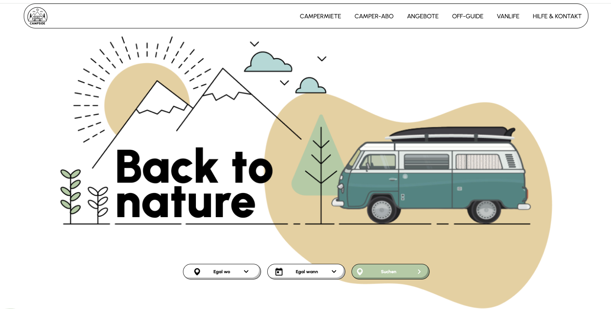

**Back to Nature**

**Projektbeschreibung**

"Back to Nature" ist eine responsive Landingpage, die mit HTML und SCSS gebaut wurde. Insbesondere die Anwendung des Nestings steht hier im Fokus.  

Inhaltlich handelt es sich um die Vermietung von Ferien-Vans für Ausflüge in die Natur, was durch sein frisches wie ansprechendes Design und die Entscheidung für Naturtöne unterstrichen wird. 

**Verwendete Technologien**

HTML, SCSS

**Responsives Design**

Die Website ist für verschiedene Bildschirmgrößen optimiert:
Desktop, mobile Geräte

**Vorschau**

